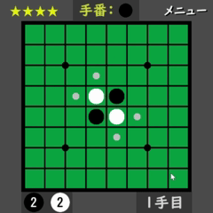
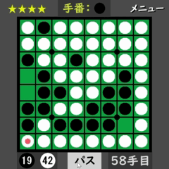

## はじめに
これは「オセロ」ゲームのリポジトリです。

## コンセプト
「立体４目並べ」では、盤面を配列で実装したため処理の負荷が大きくなっていたため、  
「オセロ」では盤面をビットボードで実装することで処理の負荷を小さくして最大探索局面数の向上を目指す。

## 仕様
- 盤面をビットボードで実装
- 定石を実装
- 思考ルーチン（COM）を実装
- Mini-Max法、αβ法を用いて思考ルーチンを設計
- ２０手目までは開放度理論を用いて手を決める＊
- 最大探索局面数：１５００万局面
- レベル星４では自分の手から数えて９手先まで探索する
- ４６手目から完全解析を試みるため４６手目、４７手目は最もCOMの思考時間が長くなる。（２０秒程度）  
  それ以降は探索局面が減るので思考時間も短くなる。
- 完全解析により４６手目以降は終局時点でCOMの石の枚数が最大になる手を選択する。  
  これにより最後までCOMが逆転を諦めないようになる。

   
  ＊『開放度理論』 
  　自分が打った石でひっくり返した石の周り８マスの空きマス（開放度）の数を基準とする理論 
   　複数枚ひっくり返す場合、そのすべての石の開放度の合計がその候補手の開放度となる
  
## ルール
- 通常のオセロと同じ

## デモGIF
- ホーム画面

  〇星が多くなるほど強くなります。  
  　星４以外は「ランダムで手を選ぶ」という条件を追加することで難易度を調整しています。
  

- プレイ画面

- エンド画面

## 使用技術
- 言語：C
- フレームワーク：Dxライブラリ
- IDE：Visual Studio 17.14.0

## 実行ファイルの位置
x64/Release/Othello.exe

画像の読み込みがあるため実行ファイルを実行するときは Release ファイル内で実行してください。

## おわりに
盤面をビットボードで実装することで「立体４目ならべ」と比べて最大探索局面数を１５倍改善することができた。  
同じロジック（Mini-Max、αβ）を使っていても処理の一部を変更することで大きな差が生まれるという学びになった。  
  
**～～「オセロクエスト」というスマホアプリで対人戦をオンラインで行った結果～～**
- 黒番：１１９勝　　９５敗　　８分　（.554）
- 白番：１００勝　１１５敗　　７分　（.466）
- 通算：２１９勝　２１０敗　１５分　（.510）

〇白番の成績が悪い理由は、黒番のほうが戦術を提示しやすく、局面を誘導できるため、  
  　各プレイヤーが得意な戦術で戦えるためであると推察する。  
  　改善策として、定石の数を増やす、ロジックを見直す、機械学習の導入が挙げられる。

製作期間：１カ月
